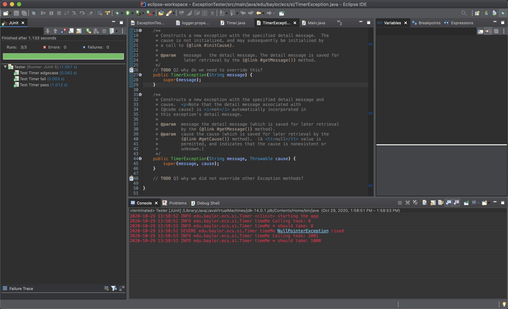
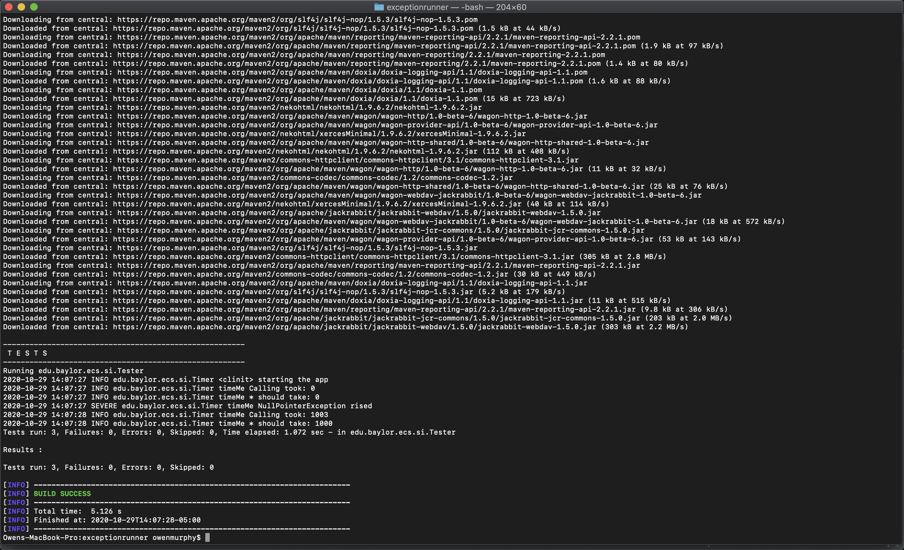

# Software 1 Lab 10 Answers

1. The two logs are different due to the specifications of the logger.properties file. The logger.properties file directs all Levels of logs to go to the File Logging. This include **INFO, SERVER, FINER** logs. Furthermore, the logger.properties file directs **INFO** levels to the console

2. The long sentence comes from the Timer Exception that is thrown due to a value of -1 being passed into the `Timer.timeMe()` inside the `failOverTest()` method.

3. 'assertThrows()' asserts execution of supplied executable which throws an exception of the excpectedType and returns the exception

4. The following in regards to TimerException class
    1. each serializable class is associated with it a version number called serialVersionUID. It is used during deserialization to verify sender and receiver of serialized object have loaded classes for object and are compatible with respect to serialization. It is **IMPORTANT** to specify a serialVersionUID because having if not, the number is auto generated. This auto generated serialVersionUID is compiler dependent and is not guaranteed to match other compilers auto generated number. 

    2. the exception constructors are not 'overridden' per say. All they do is call the super classes constructor. The constructors either catch an exception thrown by the super class or throw that same exception of its super type

    3. Method overriding in Exception class causes ambiguity and confuses the compiler on which definition to be followed. 

5. The static block is executed every time when a class loads into memory. This static block {} is loading and setting the log properties for the Logger

6. Bitbucket Server uses MD for formatting text. MD can be used for (1) pull request's description or comments or (2) in README files (having .md file extension)

7. The test was failing because when timeMe(-1) was run, the 'timeNow' was still null in the 'finally' block. Thus, a NullPointerException was thrown but not caught. To remedy, simply add a try catch block that catches the NullPointerException being thrown and log the error to the 'logger'

8. The actual problem here is that the program was that a NullPointerException was being thrown but not handled in the timer class

9. 

10. 

11. See below
    1. Since TimerException extends Exception class which is a type of **checked exception** it too is a **checked exception**. 
    2. A NullPointerException is a **runtime exception** which is a type of **unchecked exception**.
